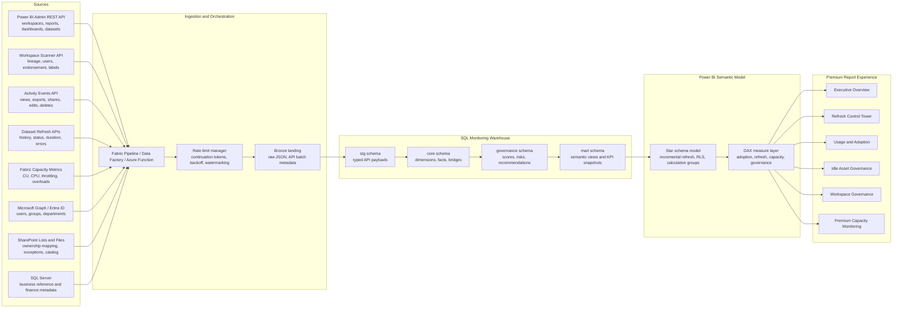

# Architecture

## North Star

Create a governed observability layer for every Power BI Premium/Fabric workspace, report, semantic model, refresh, user interaction, and capacity event. The platform must answer three questions at executive speed:

1. Is the platform healthy?
2. Is content being used?
3. Where should governance teams act next?

## Reference Architecture

## Data Flow

| Layer | Responsibility | Storage | Refresh Cadence |
| --- | --- | --- | --- |
| Bronze | Preserve API payloads exactly as received with run id, source, request URL, response status, continuation token, and ingestion timestamp. | SQL `stg.raw_api_payload` or data lake JSON | 15 min to daily depending on source |
| Staging | Type and flatten JSON payloads without applying business logic. | SQL `stg.*` tables or views | Same as bronze |
| Core | Normalize into durable dimensions and facts with surrogate keys, history, soft delete handling, and dedupe. | SQL `core.*` tables | Hourly for usage/refresh, daily for metadata |
| Governance | Compute risk signals, health scores, stale asset flags, orphan flags, recommendation candidates, and SLA results. | SQL `governance.*` tables/views | Hourly and daily snapshots |
| Mart | Serve report-ready views and KPI aggregates. | SQL `mart.*` views | On demand by semantic refresh |
| Semantic | Power BI star schema, measures, drill-through logic, incremental refresh partitions, and RLS. | Power BI semantic model | 15 to 60 min |

## Source Strategy

| Source | Primary Use | Notes |
| --- | --- | --- |
| Power BI Admin Groups API | Workspace inventory and expanded artifacts | Use paged `$top`/`$skip` patterns and admin permissions. |
| Workspace Scanner APIs | Lineage, artifact users, endorsement, sensitivity, detailed metadata | Scanner results are short lived, so persist raw results immediately. |
| Activity Events API | Usage, adoption, user behavior, governance activity | Pull one UTC day at a time and retain beyond native audit window. |
| Dataset Refresh APIs | Refresh history, status, duration, retries, failures | Persist frequently because native history retention is limited. |
| Fabric Capacity Metrics | Capacity load, CU trends, throttling, overload and forecasting inputs | Use exported metrics or replicated metric model outputs where supported. |
| Microsoft Graph / Entra ID | User department, manager, active state, identity enrichment | Cache daily, join by UPN and Entra object id. |
| SharePoint | Owner overrides, governance exceptions, catalog tags, application mapping | Treat SharePoint lists as governed reference data. |
| SQL Server | Business hierarchy, cost center, SLA tiers, workspace classification | Make SQL reference data the master for enterprise-specific mappings. |

## Ingestion Patterns

- **Metadata inventory:** daily full scan plus hourly delta using modified workspaces where available.
- **Activity events:** hourly pull by UTC date window with continuation token handling; store immutable events.
- **Refresh history:** hourly scan for all active refreshable semantic models; dedupe by `requestId`, `datasetId`, and `startTime`.
- **Capacity telemetry:** 15-minute or 30-minute snapshots for executive health and forecasting.
- **Reference data:** daily refresh from SharePoint, Entra ID, and SQL Server.
- **Late arriving data:** all facts include `ingested_utc`, `source_modified_utc`, and `batch_id`; report measures use event timestamps, not ingestion timestamps.

## Security Model

- Use a dedicated service principal approved for Fabric/Power BI admin APIs.
- Store secrets in Azure Key Vault or Fabric connections, never in M code or report parameters.
- Apply least privilege at the SQL layer with separate roles:
  - `pbi_monitor_ingest_writer`
  - `pbi_monitor_model_reader`
  - `pbi_monitor_admin_reader`
  - `pbi_monitor_exec_reader`
- Implement RLS for departments and workspace owners, with executive/admin bypass groups.
- Mask user identifiers in non-admin pages if tenant policy requires anonymized usage data.

## Performance Design

- Partition `core.fact_usage_event`, `core.fact_refresh_history`, and `core.fact_capacity_metric` by date.
- Use columnstore indexes on high-volume facts and b-tree indexes on natural keys used for merge/dedupe.
- Aggregate daily KPIs into `mart.kpi_daily_snapshot` for homepage speed.
- Keep report pages under 8 to 12 visuals each; detailed lists use drill-through tables with field parameters.
- Use incremental refresh in the semantic model:
  - Usage events: retain 36 months, refresh last 7 days.
  - Refresh history: retain 24 months, refresh last 14 days.
  - Capacity metrics: retain 24 months, refresh last 3 days.
  - Metadata snapshots: retain 36 months, refresh last 3 days.

## Executive KPI Logic

| KPI | Grain | Definition |
| --- | --- | --- |
| Daily Active Users | User by day | Distinct users with view/open/read interactions in the selected day. |
| Weekly Active Users | User by trailing 7 days | Distinct users with active consumption in last 7 days. |
| Monthly Active Users | User by trailing 30 days | Distinct users with active consumption in last 30 days. |
| Failed Refreshes Today | Refresh request by day | Failed refresh count where start date is today in report timezone. |
| Idle Reports Over 60 Days | Report snapshot | Active reports whose last view is more than 60 days ago or never viewed. |
| Capacity Utilization % | Capacity timestamp | Recommended display uses 95th percentile CU/CPU over the selected window. |
| Workspace Health Score | Workspace day | Weighted blend of usage, refresh health, ownership, activity, orphan risk, and stale content. |

## Workspace Health Score

Default score weights:

| Component | Weight | Score Intent |
| --- | ---:| --- |
| Usage score | 20% | Reward consistent adoption relative to expected audience. |
| Refresh health score | 25% | Penalize repeated failures and missed refresh SLAs. |
| Ownership score | 15% | Penalize missing, inactive, or single-owner workspaces. |
| Activity score | 15% | Penalize workspaces with no meaningful recent activity. |
| Orphan risk score | 10% | Penalize deleted or disabled owners and unmanaged service accounts. |
| Stale content score | 15% | Penalize high ratios of unused reports and stale semantic models. |

Bands:

| Score | Status | Color |
| ---:| --- | --- |
| 80 to 100 | Healthy | Green |
| 60 to 79 | Review | Amber |
| 0 to 59 | Critical | Red |

## Production Controls

- Capture every API call in `stg.ingestion_batch` and `stg.raw_api_payload`.
- Apply idempotent upserts keyed by stable API ids.
- Add retry policy for HTTP 429/5xx with exponential backoff.
- Alert if ingestion freshness exceeds SLA:
  - Activity events older than 2 hours.
  - Refresh history older than 2 hours.
  - Capacity metrics older than 30 minutes.
  - Metadata inventory older than 24 hours.
- Keep operational alerts outside the same semantic model when possible, so report refresh issues do not hide platform failures.

## Assumptions

- The tenant has Power BI/Fabric admin API access enabled for the monitoring service principal.
- The organization permits retention of activity events beyond native API windows in the internal SQL monitoring warehouse.
- Capacity telemetry is sourced from Fabric Capacity Metrics app exports, Log Analytics/Eventhouse workspace monitoring, or an approved internal replication path.
- Usage metrics are derived primarily from Activity Events because they are tenant-wide and retainable.
